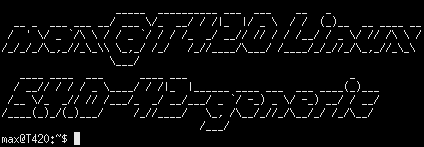

# etc

This is an assortment of small tools that I made in order to perform tasks with more efficiency or have some fun with. Most of these will likely be in shell scripts (*Nix/*Nux compatible), but I might push some tools written in C for more specific jobs.

I have no intentions of dissuading Windows users from trying some of these out, but those few who are interested in these tools will likely have to install extra applications in order to run these (Cygwin, MinGW).

## Planned feature checklist
### qfetch
- [ ] Add support for toilet
